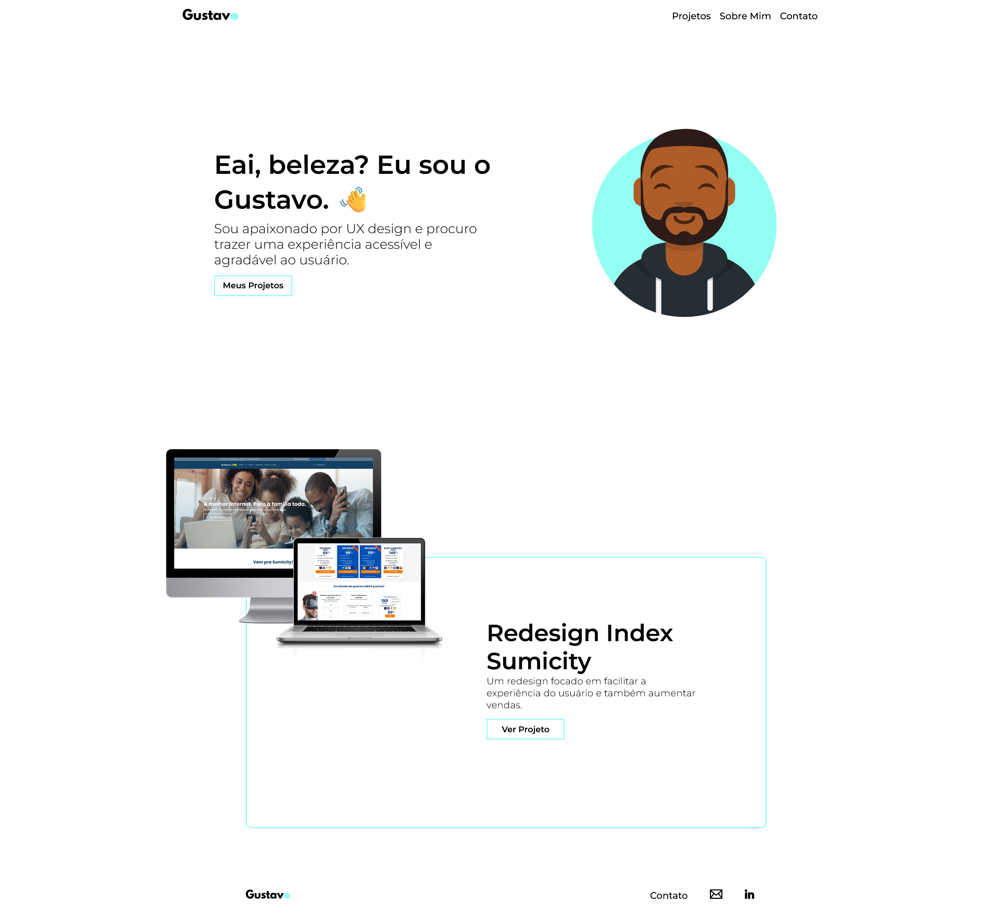

# Portfolio (2022)
🇧🇷 Em 2021 eu comecei a ter uma curiosidade por UX Design e isso me levou a começar a cursar UX Design na CareerFoundry. Como os projetos do curso eram um pouco mais simples, decidi fazer o meu próprio projeto. A minha ideia foi criar um website de portfolio para apresentar projetos. 
O projeto escolhido foi o redesign de uma Landing Page para um serviço de internet [Resultado Final](https://www.behance.net/gallery/235735233/Sumicity-Landing-Page-Redesign-%282022%29).

🇬🇧 In 2021 I started to get curious about UX Design and that lead me to start a UX Design course on CareerFoundry. But projects there were a bit simple so I decided to do a project of my own. My idea was to create a portfolio website to showcase projects. 
I ended up doing only one project, a Landing Page redesign for an Internet Provider [Final Result](https://www.behance.net/gallery/235735233/Sumicity-Landing-Page-Redesign-%282022%29).

## 💻 Website Preview

### Landing Page

### Case Study Page

